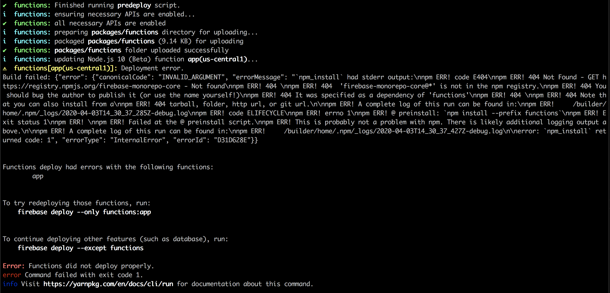

# Introduction

Boilerplate to demonstrate a monorepo that utilises [Yarn workspaces](https://classic.yarnpkg.com/en/docs/workspaces/) and deploys to Firebase. 

## Packages

Our workspaces are hosted in the `packages` directory:

```
packages/           
  core/             // custom core package, shared by functions and web
  functions/        // firebase functions package (node.js express)
  web/              // web package (react)
```

... and configured in `package.json`:

```
"workspaces": {
    "packages": [
        "packages/*"
    ],
    "nohoist": [
        "**/firebase-monorepo-core"
    ]
}
```

In a desperate attempt to enable Yarn workspaces in Firebase (and therefore share our `core` package) we use the `nohoist` feature to create symlinks to the `core` package within the `node_modules` directories of `functions` and `web` (see https://stackoverflow.com/q/55783984/373406 for more information).

Within the `functions` and `web` packages.json files, we supply a reference to our `core` package:

```
"dependencies": {
    "firebase-monorepo-core": "*"s
}
```

# Installation

Clone the repository, `cd` into your local directory and run `yarn`.

# Development

You can now run the functions and web services by running the following commands in separate terminal processes:

```
$ yarn start:functions
$ yarn start:web
```

# Deployment

Similar to development, deployment can be executed by running the following commands:

```
$ yarn deploy:functions
$ yarn deploy:web
```

# Issues

In it's current state, the `functions` package fails to deploy to firebase:



`ERR! 404 Not Found - GET https://registry.npmjs.org/firebase-monorepo-core - Not found\nnpm ERR! 404 \nnpm ERR! 404  'firebase-monorepo-core@*' is not in the npm registry.\nnpm ERR! 404 You should bug the author to publish it (or use the name yourself!)\nnpm ERR! 404 It was specified as a dependency of 'functions'\nnpm ERR! 404 \nnpm ERR! 404 Note that you can also install from a\nnpm ERR! 404 tarball, folder, http url, or git url.\n\nnpm`

There are no errors when the service is run locally, or built for deployment.

However, there are no issues with deployment to the web service, even though this also references the same `core` package, in the same way.